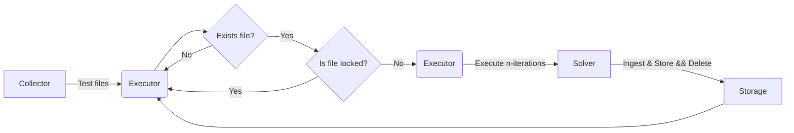
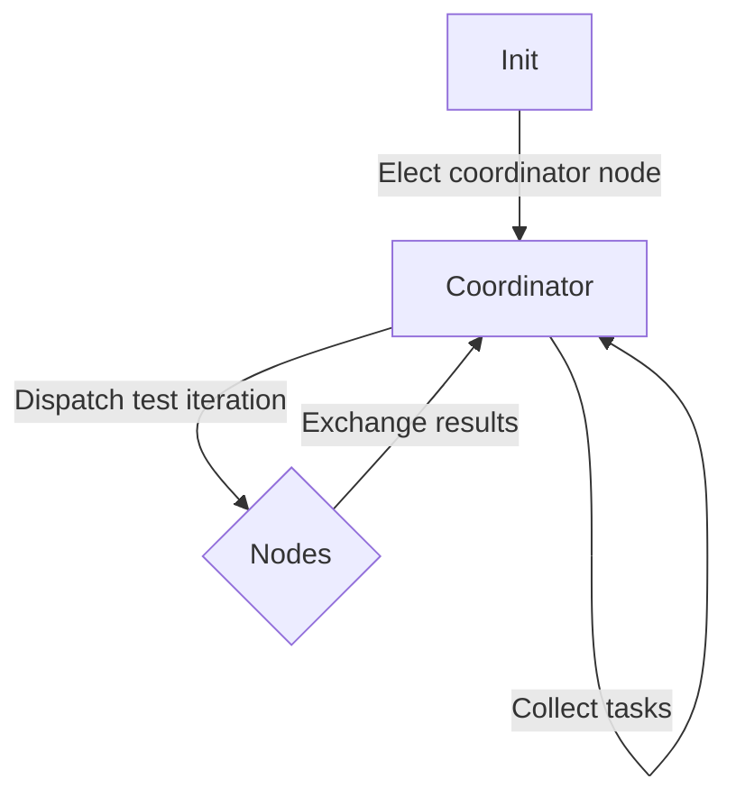

# Components

SATAn is being created to support the development of new SAT solvers.
It specifically should help with collecting metrics about execution on various tests with reproducible benchmark suits.
This is achieved by providing a modular architecture that was built to accomodate the diverse output struture and metric sets of SAT solvers.

In the current design there are five major components:

??? info "Life of a test"

	```mermaid
	flowchart TD
	  IT[Startup] -->|Config| C[Collector]
	  C -->|Tests| E[Executor]
	  E -->|Solver output| I[Ingestor]
	  I -->|Structured Metrics| S[Storage]
	  S -->|SQL DB| A[Analysis]
	```

The collector, executor, ingestor and storage are handled by the runner.
The startup/ collection may need be done beforehand for some distributed use-cases.
Analysis will be handled by a separate set of tools that will most likely consist of Jupyter Notebooks/ Python.

## Collector

The collector takes your tests from the filesystem or a GDB compliant web service and distributes them to the executor.
This component is very simple at the moment but may later be extended to, e.g., accommodate various file formats (dnf, icnf, ...) and facilitate conversion between them.

## Executor

The heart of SATAn is the executor.
It is responsible for supervising the execution of SAT solvers and should facilitate running in distributed and local environments without extra developer overhead.

At the moment only a local thread pool-based executor is implemented that covers basic features like:

- pinning SAT solvers to logical CPUs (configurable)
- executing `n`-iterations of solvers for single tests (configurable)
- enforcing timeouts
- data-based parallelism with one SAT solver executed per logical CPU at a time (configurable)

In planning/ development is a distributed executor that builds on top of the local executor to allow for distributed testing in cluster environments.

### Distributed Executor

!!! note

	The distributed executor offers various strategies is currently in the planning phase.
	It hooks into the storage and collector layer and doesn't just work on the executor layer.
	The design and strategies below are proposals and I'm grateful for any feedback.

The distributed executor is intended for clustered environments with, e.g., SLURM.
It requires at least a shared file system and can (optionally) use [MPI](https://en.wikipedia.org/wiki/Message_Passing_Interface) for actively coordinated work distribution.

Effectively this executor is a wrapper around the local executor that distributes work over many nodes running SATAn runner.
As such it offers the same advantages and limitations as the local executor on a per-node basis.

Coordination of work should be possible in two ways:

1. filename-based coordination (`Locking`) that relies on the FS for reliable synchronization.
2. (recommended) Coordination with a dedicated coordinator and communication over MPI (`Coordinated`)

??? note "Other coordination methods"

	If required Redis or a comparable system could also be used for coordination.
	However, support for it is not planned at the moment because it doesn't seem to be viable in many HPC clusters.
	It can be implemented if reasonable demand arises in the future.

#### `Locking` coordinator

!!! info "Requirements"

	A shared, reliable file system, like [Lustre](https://www.lustre.org/) (with `-o flock` mount) or [BeeGFS](https://en.wikipedia.org/wiki/BeeGFS).

	The `Locking` coordinator relies on the `rename` being atomic and hostnames being unique across the cluster for synchronization.

???+ warning "Limitations"

	The `Locking` coordinator relies on the FS and as such will have a rather high usage of metadata related syscalls.
	This is proportional to the throughput of the executor but should be kept in mind when working with, e.g., Lustre to avoid overly straining the metadata servers in shared environments.
	It shouldn't be a problem in low throughput (above 10-50 ms per run) scenarios.

	This coordinator doesn't allow scheduling of test iterations on multiple nodes.
	You should check the node to node performance delta and account for it when doing analysis down the line.

	Results are stored in a separate database file per node when SQLite or DuckDB.
	This requires the cluster to have unique hostnames per node, like `bcn[1000-1500]`, this might be mitigaed later on as seen fit with, e.g. a random prefix.
	These files can be merged by the runner `runner merge [filenames ...]` afterwards.

	If any of the above problems are a potential problem consider the `Coordinated` coordinator.
	It is the recommnded way to work in a cluster environment.

The `Locking` coordinator represents the KISS approach to a distributed system with synchronization being handed over to the FS.
This approach should be used when there is no available MPI network between nodes.
It also is tolerant to node failure with only the tests currently executed by the nodes being lost.

The `Locking` coordinator works by deterministically collecting files and locking files by renaming them.
Specifically files being processed at the moment are renamed to `[processing]_{filename...}` and files that are done are renamed to `[done]_{filename...}`.
The runner also offers the `clean-prefix` subcommand to remove all `[processing]_` and `[done]_` prefixes from tests.

This file will then be copied into a temporary file and dispatched to the local executor.
**After completion the original test file will be deleted**.
(Support for moving instead of deleting files is planned too).
This is required to allow for passive cooperation between the nodes.

??? info "Useful runner commands"

	The runner can prepare all test files for you in separate directory.
	For this the collector will select all eligible files, copy them and restructure them into separate directories per test set.
	An adjusted config with the updated paths will be provided by the runner too.


The rough flow of actions is outlined below.



#### `Coordinated` coordinator

!!! info "Requirements"

	This coordinator requires MPI for internode communication.

???+ warning "Limitations"

	This coordinator will cost one logical CPU for the coordinator for a single node (so called _coordinating_ node).

On startup single node is elected via Raft or Paxos as the leader.
This node will dedicate a logical CPU for coordination.

This coordination node will distribute iterations of tests (configurable) with a round-robin approach on all known nodes.
The node will communicate all completed jobs and the distribution of jobs over MPI however if metrics should also be transported over MPI in the future. The rough flow is outlined below:



!!! note "Considerations for fault tolerance"

	In case this node fails during the benchmark a new leader may be elected however I have yet to figure out how to distribute the completion etc. of tasks to allow all nodes to take over in time.
	To support something like this the thread pool would have to be shrunk at runtime and couldn't just continue dispatch as seen fit.
	In such a case it also has to be considered if the benchmark should be stopped since it may make the tests inconsistent.

## Ingestor

??? note "What is YAML?"

	A good introduction to [YAML](https://yaml.org/) is available from [RedHat](https://www.redhat.com/en/topics/automation/what-is-yaml).
	tl;dr: You write `<key>: <value>` with `<value>` being a float like `1.2` or integer like `1` for ingestors.

	YAML was choosen because I like it and it is quite easy to prouce KV-pairs for this usecase.
	I'm open to TOML, JSON or another simple format being supported too.


The ingestor takes the `stdout`, `stderr` and exit code of a solver and extract metrics as KV-pairs YAML.
At the moment only two ingestors are supports:

- `Null` ingestor: This ingestor expects the solver to output KV-pairs of YAML to stdout. Intended for solvers that are writte with SATAn in mind.
- `Exec` ingestor: This ingestor dispatches the ingesting task to an executable on the system and effectively redirects the solver `stdout` to the `stdin` of this executable (`stderr` and the exit code are exposed via environment variables)

!!! info
	There is an effort to create a collection of pre-made executors for solvers at [SATAn/ingestors collection](https://gitlab.cobalt.rocks/satan/ingestors).

## Storage

The storage is handled by either SQLite or DuckDB on a per-node basis.
At the moment both are used with a single connection per runner to avoid any locking problems.
This will eventually be changed for at least SQLite to use a connection per thread.

Eventually [ClickHouse](https://clickhouse.com/) should also be supported for large systems.

## Analysis

TODO
